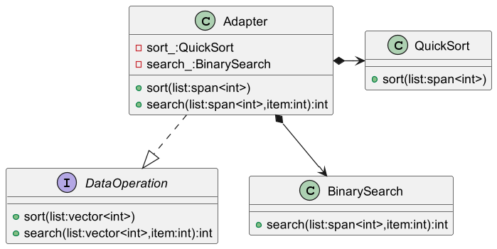
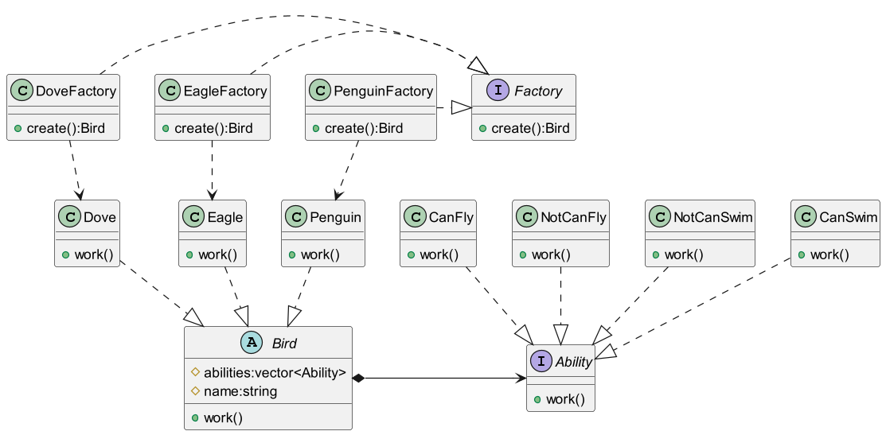
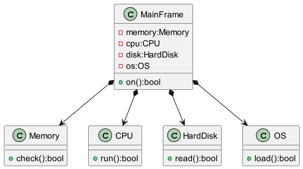
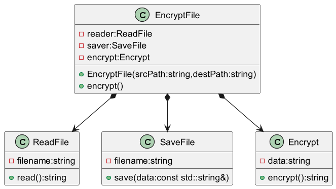
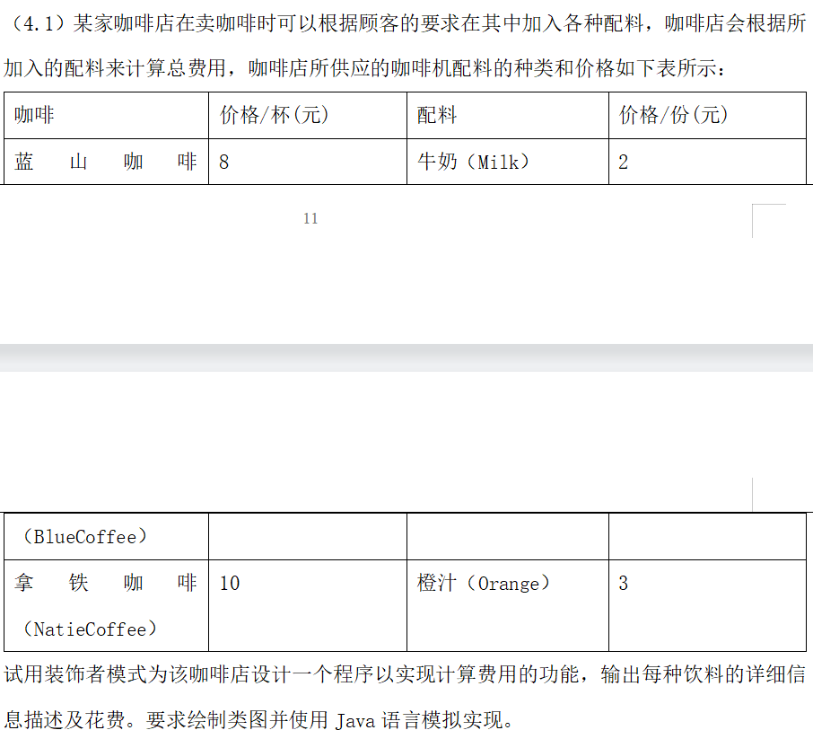
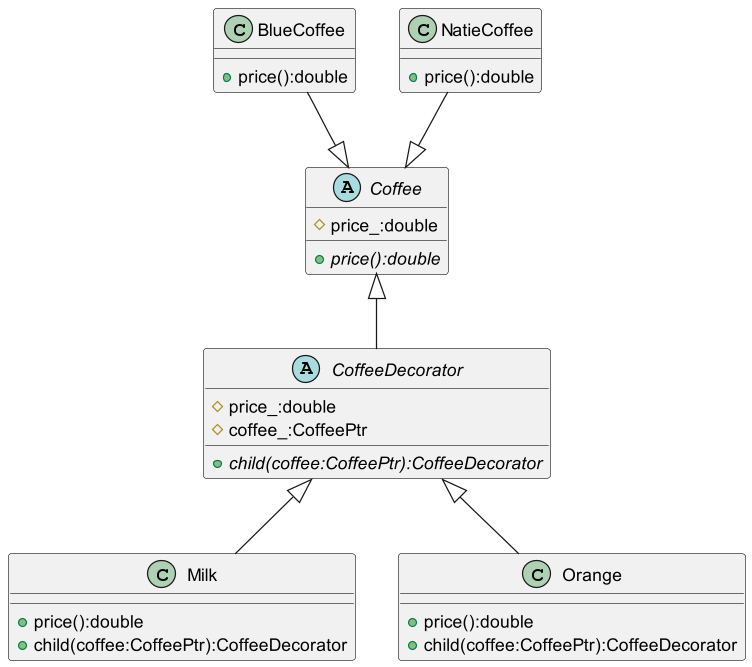

<!-- TOC -->
* [结构型模式](#结构型模式)
  * [1. 适配器模式](#1-适配器模式)
    * [题目](#题目)
    * [具体实现](#具体实现)
    * [总结](#总结)
  * [2. 桥接模式](#2-桥接模式)
    * [题目](#题目-1)
    * [具体实现](#具体实现-1)
    * [总结](#总结-1)
  * [3. 外观模式](#3-外观模式)
    * [题目一](#题目一)
      * [具体实现](#具体实现-2)
      * [总结](#总结-2)
    * [题目二](#题目二)
      * [具体实现](#具体实现-3)
      * [总结](#总结-3)
  * [4. 装饰者模式](#4-装饰者模式)
    * [题目一](#题目一-1)
      * [具体实现](#具体实现-4)
      * [总结](#总结-4)
    * [题目二](#题目二-1)
      * [具体实现](#具体实现-5)
      * [总结](#总结-5)
  * [5. 代理模式](#5-代理模式)
    * [题目](#题目-2)
    * [具体实现](#具体实现-6)
    * [总结](#总结-6)
<!-- TOC -->
# 结构型模式

## 1. 适配器模式

### 题目
现有一个接口 `DataOperation` 定义了排序方法 `sort(int[])` 和查找方法 `search(int[],int)` ，已知类 `QuickSort` 的 `quickSort(int[])` 方法实现了快速排序算法，类 `BinarySearch` 的 `binarySearch(int[],int)` 方法实现了二分查找算法。现使用适配器模式设计一个系统，在不修改源代码的情况下将类 `QuickSort` 和类 `BinarySearch` 的方法适配到 `DataOperation` 接口中。绘制类图并编程实现。
### 具体实现
* 类图:

* 类实现:
  * [adapter.h](adapter.h)
* 测试:
  * [adapter_test.cc](../../tests/adapter_test.cc)
### 总结
适配器模式通过一层间接接口来组合实现本来就有的功能,可随时插拔.

## 2. 桥接模式
### 题目
二、在HuntBird游戏中，需要模拟不同鸟的多种行为，鸟类中提供了对其各种行为信息进行显示的show()方法，目前游戏需要呈现的是鸽子和企鹅的飞和游泳行为，现使用桥接模式设计该游戏（设计需要考虑到后期鸟的种类和行为的变化性），要求绘制该应用的UML类图，并实现。（能力较好的同学可以综合运用工厂模式和桥接模式来完成，其中工厂模式用于创建各种鸟类）
### 具体实现
* 类图:
  
* 类实现:
    * [bridge.h](bridge.h)
* 测试:
    * [bridge_test.cc](../../tests/bridge_test.cc)
### 总结
通过工厂方法模式让不同种类的鸟使用不同的工厂进行生产,通过桥接模式来动态的赋予不同鸟类不同的能力,拓展性非常的好.

## 3. 外观模式
### 题目一
（3.1）在电脑主机（MainFrame）中只需要按下主机的开机按钮（on（））,即可调用其它硬件设备和软件的启动方法，如内存（Memory）的自检（check()）、CPU的运行（run()）、硬盘（HardDisk）的读取（read()）、操作系统（OS）的载入（load())等，如果某一过程发生错误则电脑启动失败。使用外观模式模拟该过程，绘制类图并使用Java语言模拟实现。
#### 具体实现
* 类图:
  
* 类实现:
    * [facade_1.h](facade_1.h)
* 测试:
    * [facade_1_test.cc](../../tests/facade_1_test.cc)
#### 总结
外观模式是我们平时写代码最常会写出来的代码,只要实现功能然后拼凑出一个类即可,但是拓展性非常的差,因为没有通过任何中间层,而是直接通过类组合的方式获得能力.

### 题目二
（3.2）某系统需要提供一个文件加密模块，加密流程包括三个操作，分别是读取源文件、加密、保存加密之后的文件。读取文件和保存文件使用流来实现，这三个操作相对独立，其业务代码封装在三个不同的类中。现在需要提供一个统一的加密外观类，用户可以直接使用该加密外观类完成文件的读取、加密和保存三个操作，而不需要与每一个类交互，使用外观模式设计该加密模块，要求编程模拟实现。 
#### 具体实现
* 类图:
  
* 类实现:
    * [facade_2.h](facade_2.h)
* 测试:
    * [facade_2_test.cc](../../tests/facade_2_test.cc)
#### 总结

此处加密我并未用可逆的加密,只是用了SHA256.外观模式是我们平时写代码最常会写出来的代码,只要实现功能然后拼凑出一个类即可,但是拓展性非常的差,因为没有通过任何中间层,而是直接通过类组合的方式获得能力.

## 4. 装饰者模式
### 题目一

#### 具体实现
* 类图:
  
* 类实现:
    * [decorator_1.h](decorator_1.h)
* 测试:
    * [decorator_1_test.cc](../../tests/decorator_1_test.cc)
#### 总结

装饰者模式适合一些需要把一个属性不断装饰的情况,比如写一些UI界面,前端UI都是需要不断套娃的层级关系来修饰显示的效果,本题是基于咖啡加配料,配料作为装饰品可不断套娃叠加.

实现装饰者模式需要创建一个新的抽象类类用于实现不同的装饰者,而这个抽象类需要继承被装饰者的接口,这样在使用的时候就能够无限套娃了.

### 题目二
（4.2）装饰模式实例之界面显示构件库
某软件公司基于面向对象技术开发了一套图形界面显示构件库VisualComponent。在使用该库构建某图形界面时，用户要求为界面定制一些特效显示效果，如带滚动条的窗体或透明窗体等。现使用装饰模式设计该构件库，绘制类图并编程模拟实现。实现的具体效果与桥接模式有些相似。
#### 具体实现
* 类图:
  
* 类实现:
    * [decorator_2.h](decorator_2.h)
* 测试:
    * [decorator_2_test.cc](../../tests/decorator_2_test.cc)
#### 总结
装饰者模式适合一些需要把一个属性不断装饰的情况,比如写一些UI界面,前端UI都是需要不断套娃的层级关系来修饰显示的效果,本题正好是基于窗口UI实现了两种装饰器,我采用的C++中的Qt框架来实现.

实现装饰者模式需要创建一个新的抽象类类用于实现不同的装饰者,而这个抽象类需要继承被装饰者的接口,这样在使用的时候就能够无限套娃了.

## 5. 代理模式
### 题目
在某商品购物系统中，注册用户可对商品进行订购，商品的订购信息以订单的方式体现，假设只有用户才能对自己的订单进行修改，其他人都不能修改。试使用代理模式来设计并实现。
要求订单中需要包括订购的商品名称（productName），订购商品数量(productNum)，下单客户姓名（customerName）的信息。
要求先设计类图并使用面向对象语言进行实现。

### 具体实现
* 类图:
  
* 类实现:
  * [proxy.h](proxy.h)
* 测试:
  * [proxy_test.cc](../../tests/proxy_test.cc)
### 总结
代理模式使用还是比较广泛的,在很多时候基于原有的接口我们需要加一些行为,这个时候就会想到使用代理模式,这个模式在平时的业务开发中经常使用.

代理模式一般分为静态代理和动态代理模式,这两个模式的差别其实主要是在灵活性上,静态代理无法把需要添加的行为抽离变为通用,而动态代理则可以通过语言本身支持的反射来将这个行为抽离强行组合形成新的代理类.

本题我模拟了一个业务的部分过程,我们可以把整个类图的体系分为三层:
* `VO` 层
* `Proxy` 层
* `DAO` 层

前端构造数据发送到后端形成 `VO` 层的数据,然后通过 `Proxy` 层实现具体的增删改查,在本题就是通过这一层实现用户对订单的修改,而具体该层的实现,则需要调用 `DAO` 层去操作.整个层次结构看下来,下层为上层提供服务.具体情况如下:

* `VO` 为前端数据验证提供服务.
* `Proxy` 为 `VO` 数据的具体行为提供服务.
* `DAO` 为 `Proxy` 的功能提供服务.